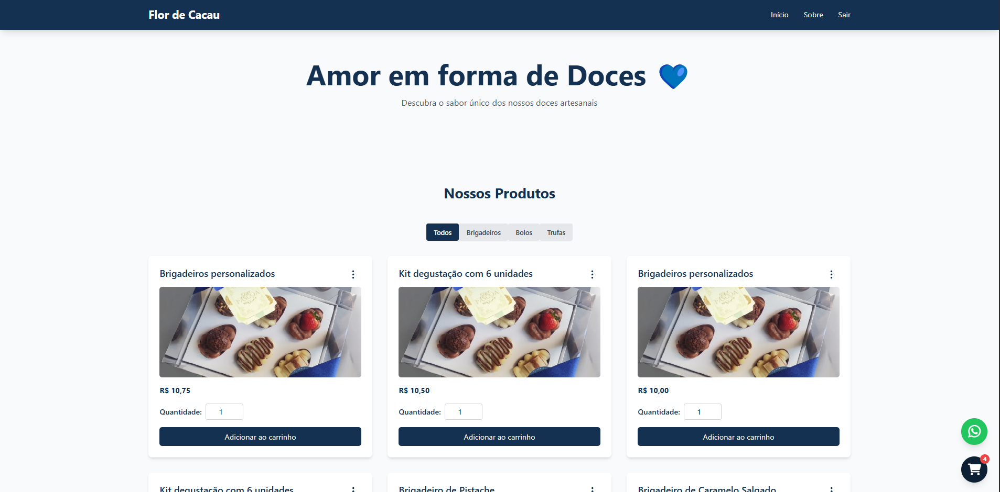
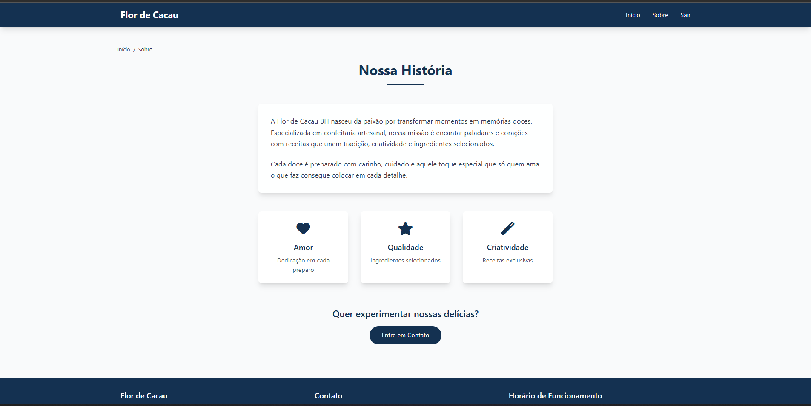
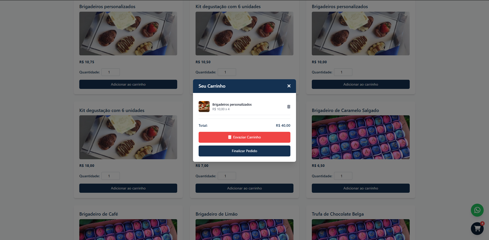

## Laravel Flor de Cacau

Projeto desenvolvido com o intuito de facilitar a venda de doces na região oferecendo uma maneira rápida e fácil de fazer pedidos online.

### Funcionalidades
- Catálogo de produtos
- Carrinho de compras
- Pedido pelo Whatsapp

### Funcionalidades do Admin
- Alterar imagem do produto
- Alterar o preço
- Atribuir doces as categorias
- Remover doces de suas categorias


### Imagens do Projeto


---

---


## Instalação

1. Clone o repositório:
    ```bash
    git clone https://github.com/ccaioadriano/laravel-flor-de-cacau.git
    ```
2. Instale as dependências:
    ```bash
    composer install
    ```
3. Configure o arquivo `.env`:
    ```bash
    cp .env.example .env
    php artisan key:generate
    ```
4. Execute as migrações:
    ```bash
    php artisan migrate
    ```


## Pendências

- [x] Implementar testes
- [x] Implementar possibilidade de excluir produtos
- [ ] Possibilidade de gerar relatórios
- [x] Adicionar menu responsivo
- [x] Implementar CRUD de categorias
    - [x] Criar tabela de categorias
    - [x] Implementar Adicionar lista de categorias (*com produtos) no catalogo
    - [x] Implementar vinculo de produtos -> categoria
    - [x] Adicionar produtos de uma categoria
    - [x] Remover produtos de uma categoria
    - [ ] Criar uma categoria
    - [ ] Editar categoria
    - [ ] Excluir categoria
- [ ] Implementar categorias temporárias (ex:pascoa, natal...)
- [x] Implementar pesquisa dinâmica no painel admin
- [ ] Adicionar eager loading nas consultas
- [ ] Melhorar painel admin (qtd_doces x categoria)


## Contribuição

Contribuições são bem-vindas! Sinta-se à vontade para abrir issues ou enviar pull requests.


